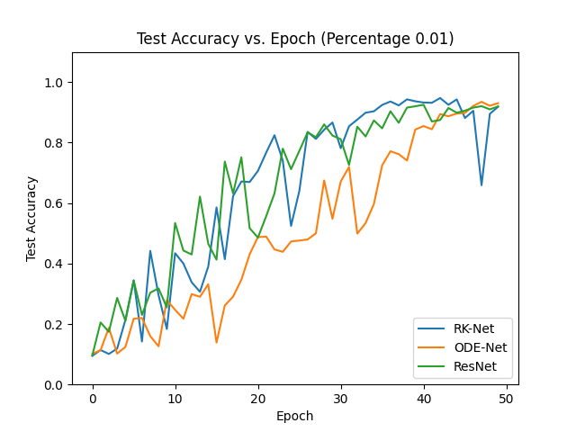
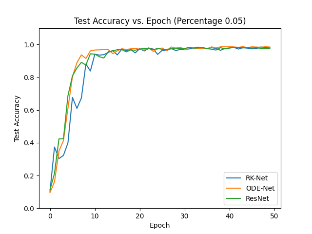
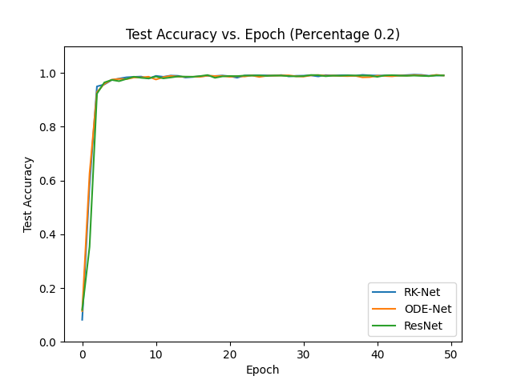
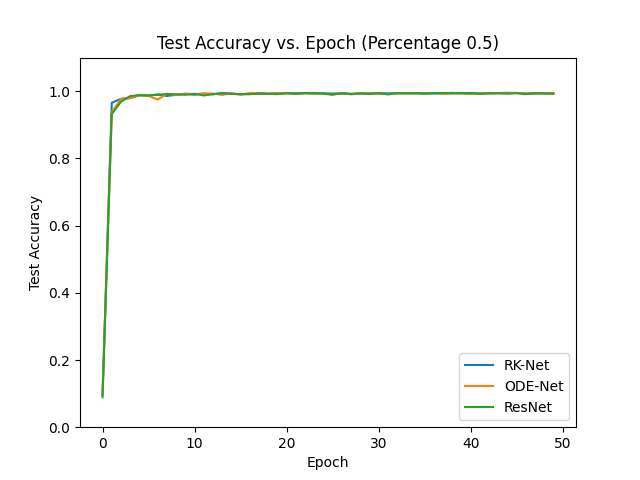
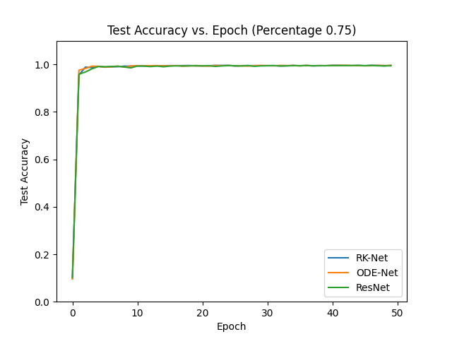
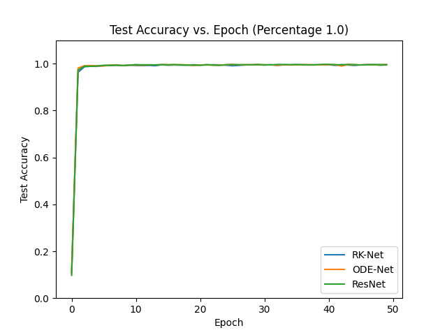
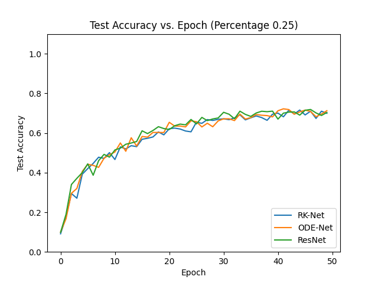
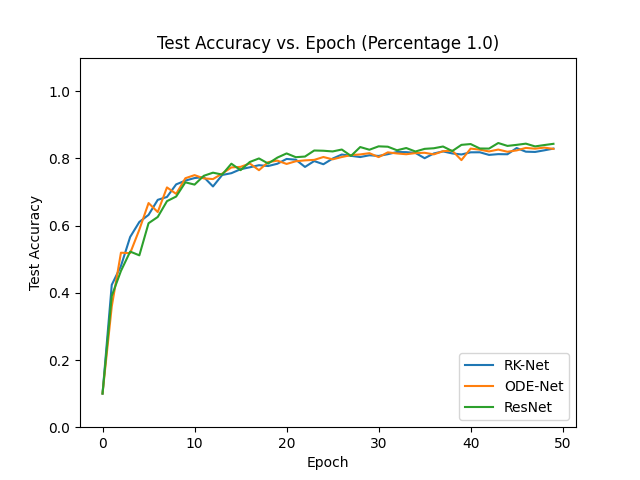

# ODE-Net Analysis

Explores the performance of ODE-Net, RK-Net, 
and ResNet architectures on the MNIST and CIFAR-10 dataset. 
Aims to visualize and compare test accuracy 
results when training the model using randomly selected
sample as percentage of the initial dataset.

## Test Accuracy Plots

Here, we present the test accuracy plots for the two datasets 
(MNIST & CIFAR-10) for the different percentages of training data.

### MNIST - 1%

### MNIST - 5%

### MNIST - 10%

### MNIST - 15%

### MNIST - 20%

### MNIST - 25%

### MNIST - 50%

### MNIST - 75%

### MNIST - 100%

### CIFAR-10 - 25%

### CIFAR-10 - 50%

### CIFAR-10 - 75%

### CIFAR-10 - 100%

